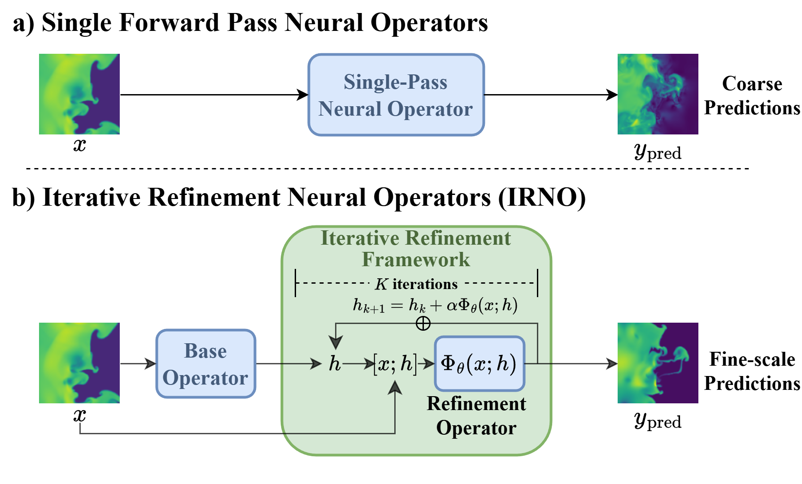

<table style="border:none; border-collapse:collapse;">
<tr>

<td width="35%" style="border:none;">

</td>

<td width="65%" valign="top" style="border:none;">

<h3>
Iterative Refinement Neural Operators are Learned Fixed-Point Solvers:
A Principled Approach to Spectral Bias Mitigation
</h3>

Xiaotian Liu, Shuyuan Shang, <b>Xiaopeng Wang</b>, Pu Ren, Yaoqing Yang

<b>ICML 2026, Spotlight (Top 2.2%)</b>

<a href="https://arxiv.org/abs/2605.24041">Paper</a> |
<a href="https://github.com/xiaotianliu-dartmouth/Iterative_Refinement_Neural_Operator/">Code</a> |
<a href="https://xiaotianliu-dartmouth.github.io/IRNO_ICML_26_Spotlight/">Website</a>

</td>

</tr>
</table>

